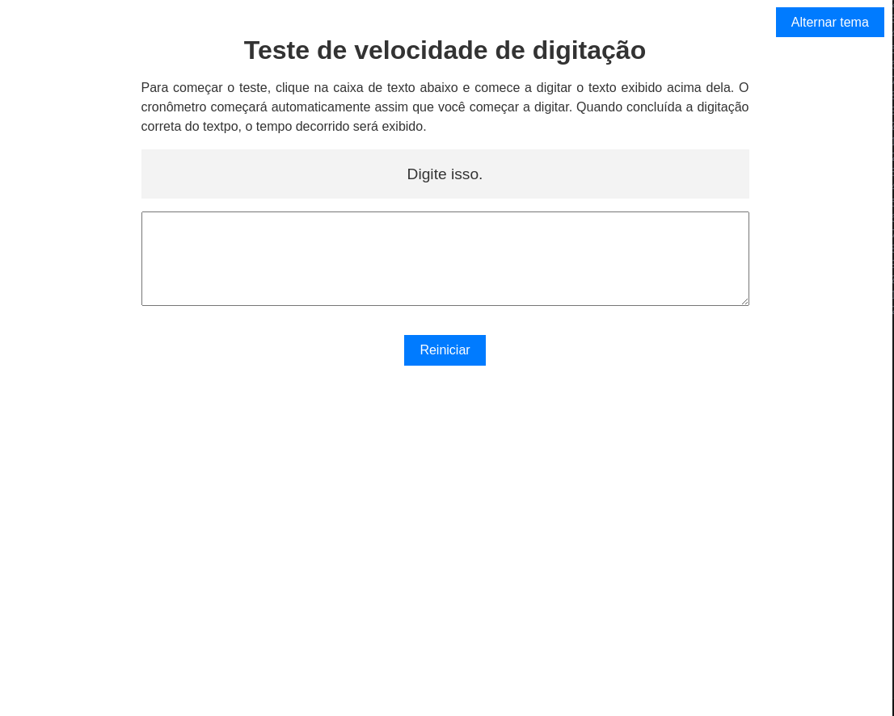
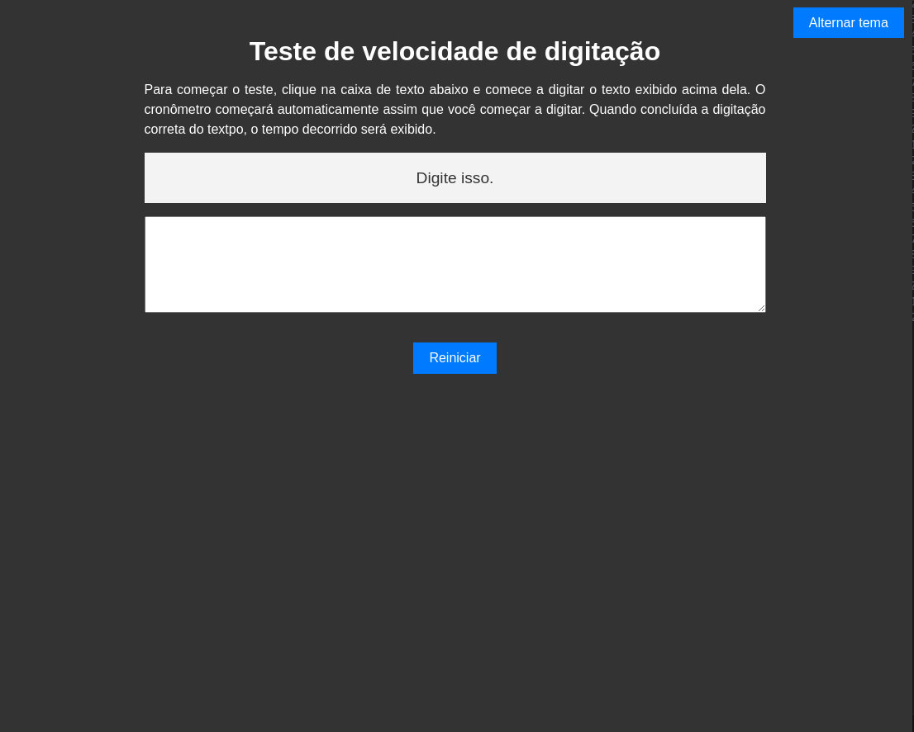

# Projeto criado a partir do HTML, CSS e Javascript. 

## Calcule em quantos segundo você conluiu a digitação de um texto curto. O botão para mudar cor do tema é funcional.

  
  

  Feito com ♡ por Helen Andrade

